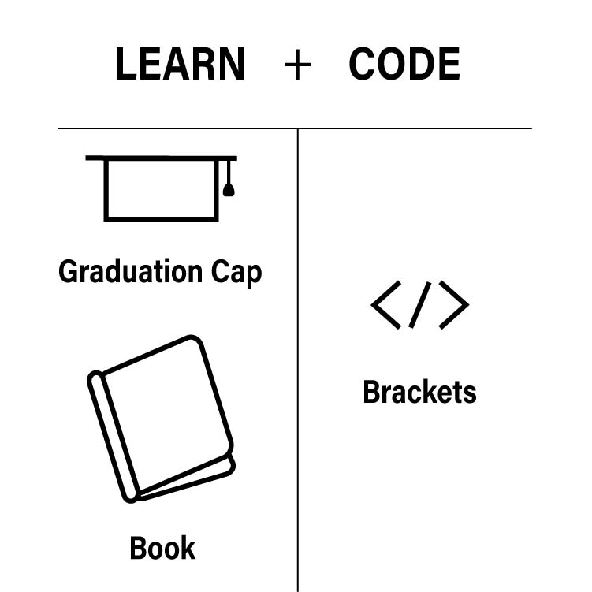
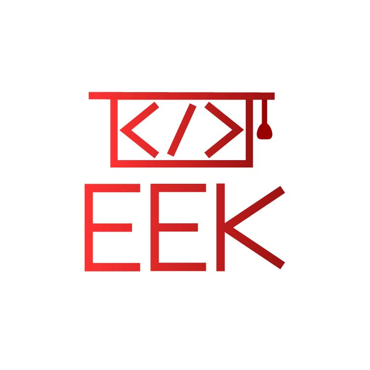
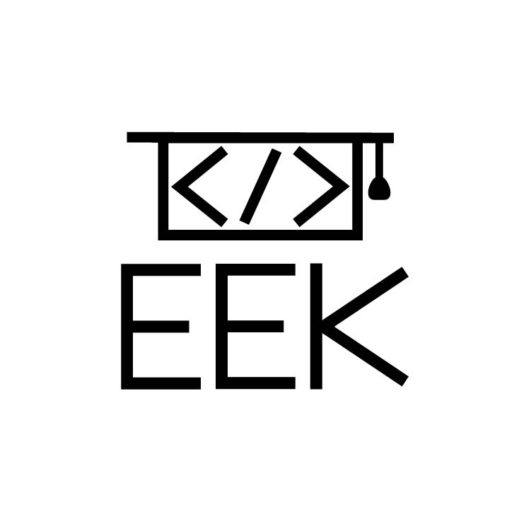
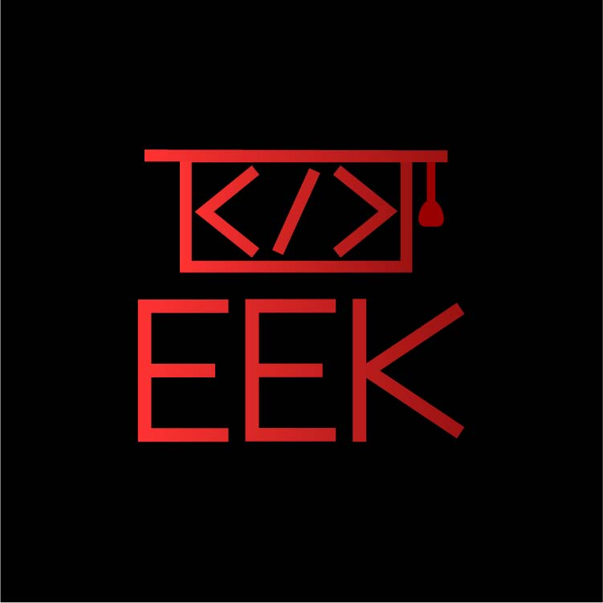
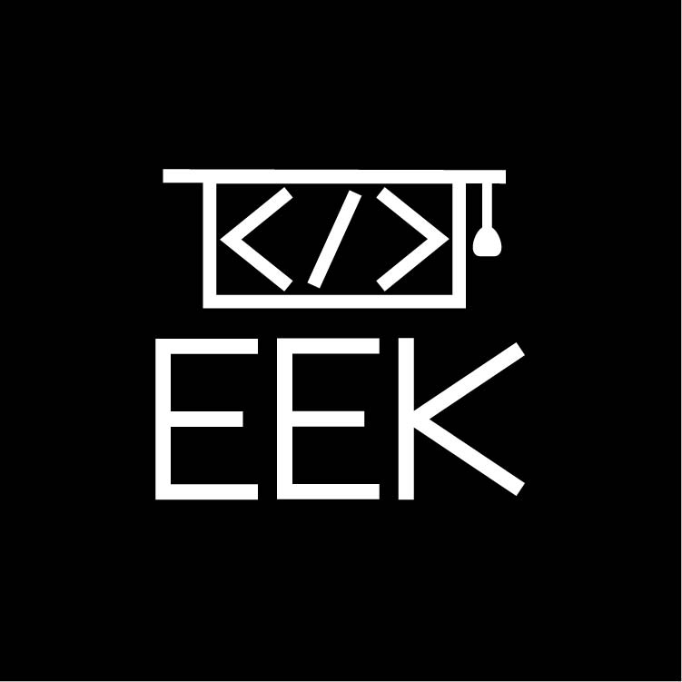
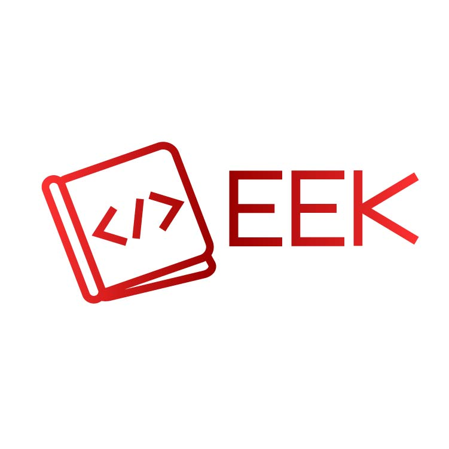
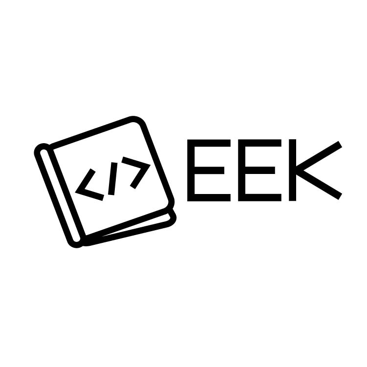
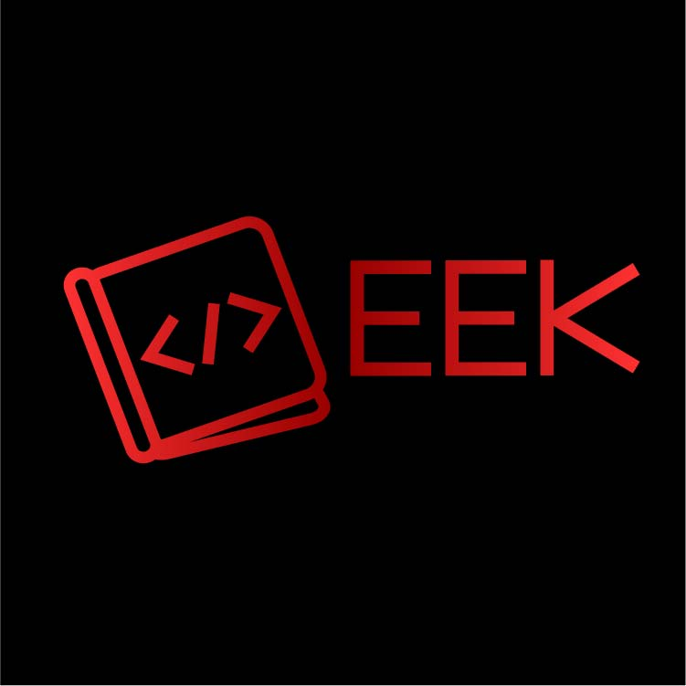
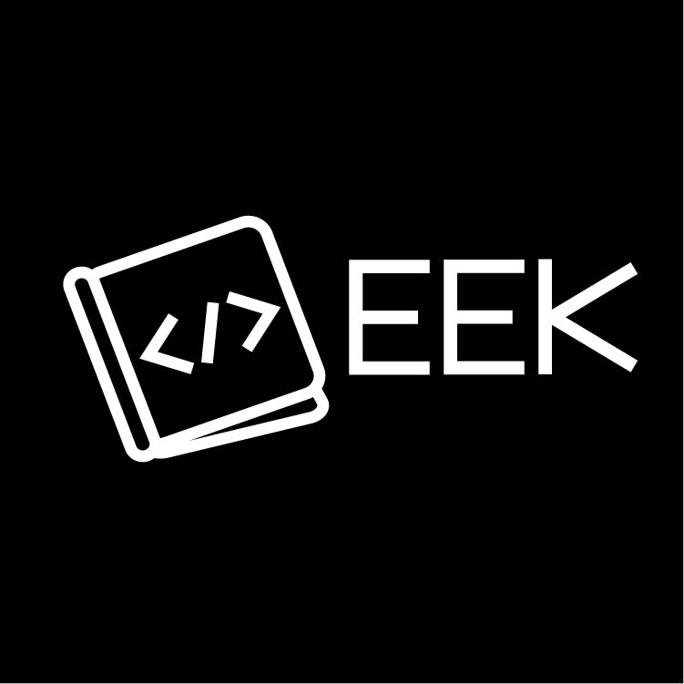

<h1 style="font-size: 20px">EEK - <i>Coding Education Company Logo</i> - 2022</h1>
<h2 style="font-size: 18px">PROJECT OVERVIEW</h2>
The following project is a logo design concept presentation for a fictional educational products company (EEK) that creates content, via innovative blockchain technology, focused on teaching the customer more about coding. (This project was created from an automatic website-generated logo design inquiry.)
<h2 style="font-size: 18px">THE CHALLENGE</h2>
The inquiry from EEK requested a logo that conveys a sense of importance, while being business-like. They wanted a combination mark that uses the color red, with the intention of embroidering it on their uniforms.
<h2 style="font-size: 18px">THE PROCESS</h2>
Keeping in mind the client's intended use of the logo, color, target audience, brand name, and business purpose, combined with the mood the client wished to convey, I created these initial images via Adobe Illustrator.
  

 
I then combined the brackets with the graduation cap and separately with the book, incorporated the company name, created two color variations and two monochromatic variations, and then generated photo mockups of the concepts in action via PlaceIt.
<h2 style="font-size: 18px">FINALIZED LOGO CONCEPT #1 (4 VARIATIONS)</h2>

    
    &nbsp;
    
    &nbsp;
    
    &nbsp;
    

 

 

<h2 style="font-size: 18px">FINALIZED LOGO CONCEPT #2 (4 VARIATIONS)</h2>

    
    &nbsp;
    
    &nbsp;
    
    &nbsp;
    

 

 

